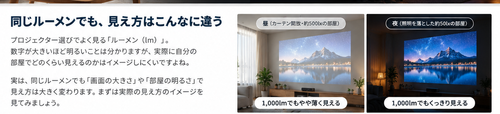
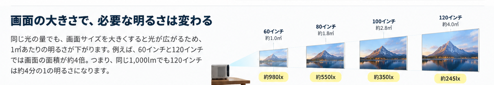
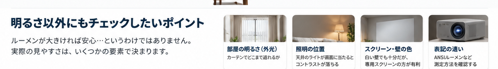
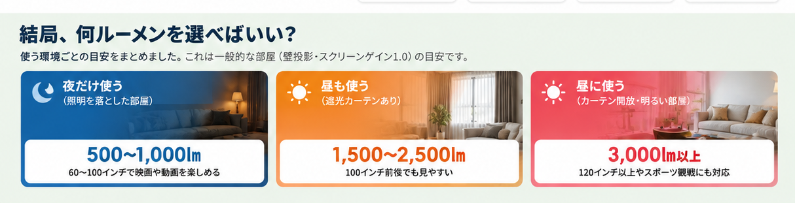

もともと使っていたのは、**Aladdin X2**。

天井の照明とプロジェクターが一体になっていて、気軽に大画面を楽しめるのが魅力でした。

ところが、しばらく使っているうちに画面に**黒いドット**が出現。そろそろ買い替え時かな、と考え始めました。黒いドットの原因はまだ分からないので、故障箇所については断定できません。

もうひとつ気になっていたのが、昼間の見え方。

日中もカーテンを閉めて使っていたのですが、それでも映像が少し見づらいことがありました。夜はそこまで気にならないのに、昼になると何となくぼんやり。

**「そもそも、昼間に快適に見るには何ルーメン必要なんだろう？」**

買い替えるなら、今度は明るさでも後悔したくない。そこで、ルーメンと部屋の明るさの関係を調べてみました。

## 昼と夜。同じプロジェクターなのに違う

昼に映像が見づらくなる理由は、単にプロジェクターの光が弱いからとは限りません。

カーテンを閉めても、隙間から光が入ったり、白い壁や天井に光が回り込んだりします。そうすると画面の暗い部分まで明るくなり、黒がグレーっぽく見えることも。

夜ならきれいに見えていた映画の暗いシーンが、昼には見えにくい。そんな差が生まれます。

つまり、**本体の明るさだけでなく、部屋の遮光もセットで考える**のが大切です。

## 100インチにすると、もっと明るさが必要？

画面が大きいほど迫力はアップ。でも、光は広い範囲に分散します。

例えば16:9の画面なら、60インチの面積は約1.0㎡、120インチなら約4.0㎡。対角サイズが2倍になると、面積は約4倍です。

同じ光量で同じ投影条件なら、画面1㎡当たりに届く光はおよそ4分の1。**大きく映すほど、明るさの余裕が欲しくなる**わけです。

## ルーメンの数字だけで選ばない

買い替え時に見ておきたいのは、次の4点。

- **部屋の明るさ**：昼は遮光カーテンを使う？ それとも自然光のまま？
- **画面サイズ**：80インチと120インチでは必要な光量が違う
- **スクリーン・壁**：投影面の色や反射特性でも見え方が変わる
- **明るさの表記**：ANSIルーメンやISOルーメンなど、測定条件が異なる数値を単純比較しない

なお、ルーメンは映像のきれいさそのものを表す数字ではありません。色、コントラスト、解像度、ファンの音、投影距離もチェックしたいところ。

特に昼の視聴を重視するなら、**明るい機種への買い替えと遮光環境の改善**を一緒に考えるのがおすすめです。

## 結局、昼と夜は何ルーメン？

80〜100インチ前後で使う家庭用プロジェクターを想定すると、ざっくり次が出発点になります。

| 使い方 | 明るさの目安 |
| --- | ---: |
| **夜だけ・照明を落とす** | **500〜1,000 ANSIルーメン程度** |
| **昼も使う・遮光カーテンあり** | **1,500〜2,500 ANSIルーメン程度** |
| **昼も使う・明るい部屋** | **3,000 ANSIルーメン以上を検討** |

これは特定の画質を保証する基準ではなく、一般的な検討目安。外光が強い部屋では3,000ルーメン以上でも見づらい場合があります。また、ANSIとISOなど異なる測定規格の数値はそのまま比較できません。

**夜だけなら500〜1,000 ANSIルーメン程度。昼も遮光して使うなら1,500〜2,500 ANSIルーメン程度。明るい昼の部屋なら3,000 ANSIルーメン以上を検討。**

買い替えでまず確かめたいのは、この違いです。
