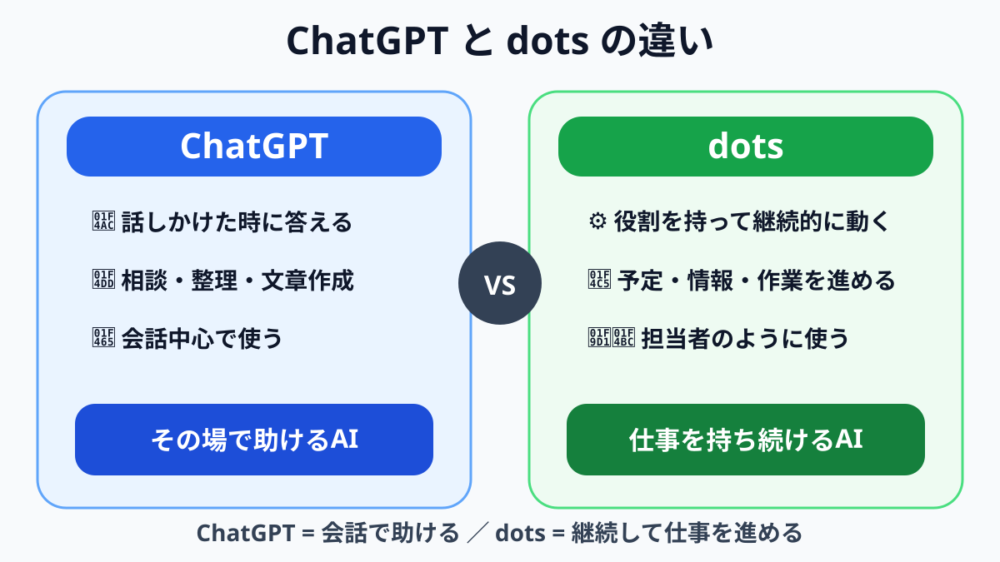
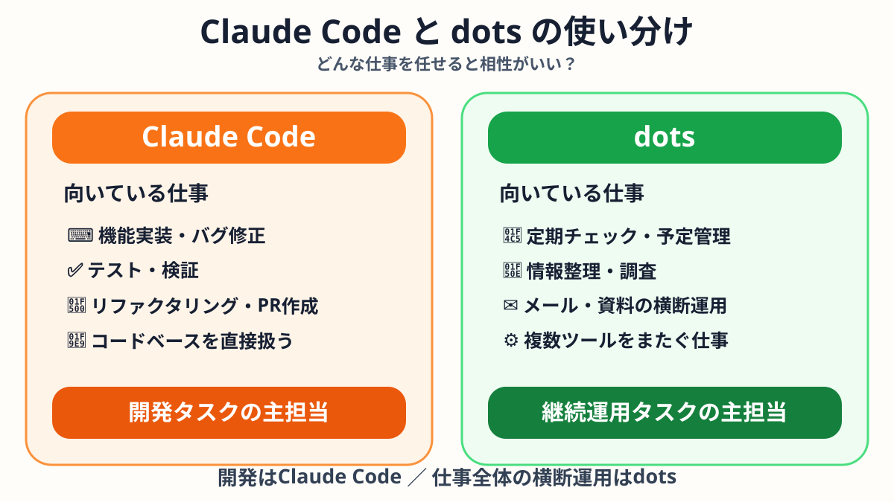
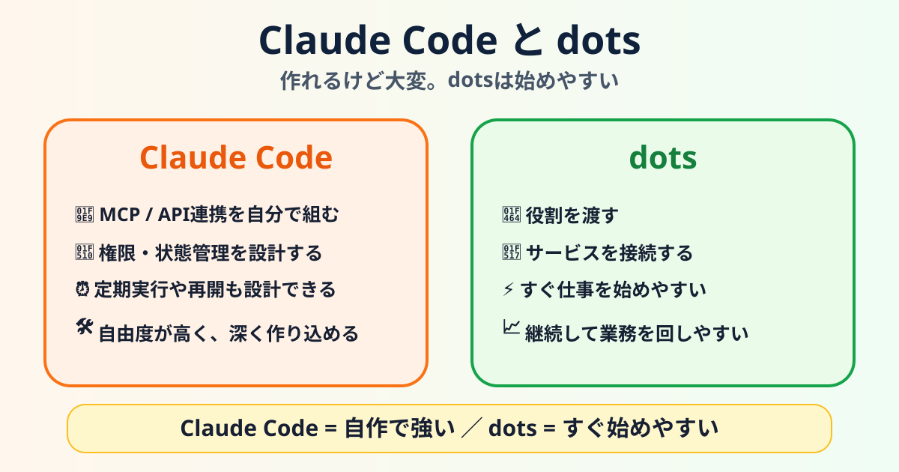

OpenAIの新しいエージェント「dots」を見て、最初に浮かんだ疑問はかなり素朴でした。

**「これ、Claude Codeで専用エージェントを作れば同じことができるのでは？」**

コードを書く。テストする。GitHubを見る。  
さらにMCPやAPIをつなげば、メールやカレンダー、資料、Webサービスにも手を伸ばせる。

だったらClaude Code側に「全体を見るディレクター」を一人置いて、その下に開発担当、レビュー担当、メール担当、調査担当を並べればいい。

理屈としては、かなり近いところまで作れそうです。

では、dotsは何が違うのか。

話を整理していくと、差は「できる・できない」より、**そこまでの仕組みを自分で作る必要があるか**にありました。

## まずChatGPTとdotsは、スタート地点が違う

普段のChatGPTは、基本的に会話が起点です。

「これを調べて」  
「今日の予定を整理して」  
「この文章を直して」

話しかけると、その場で仕事をしてくれる。

一方、OpenAIが2026年9月29日に発表したdotsは、最初から**常時稼働のエージェント**として設計されています。

OpenAIは、dotsについて専用のクラウドコンピューターを持ち、フィードバックから学びながら24時間目標に向けて働けると説明しています。また、プラグイン経由で4,000以上のアプリに接続できるとしています。

つまり感覚としては、

**ChatGPTは相談相手。dotsは担当者。**

この違いがまず土台にあります。

## でも、Claude Codeも継続して仕事できる

ここで引っかかるのがClaude Codeです。

Claude Codeは「コードを書くAI」で終わりません。

AnthropicはClaude Codeを、コードベースを理解し、ファイルを編集し、コマンドを実行し、Gitワークフローまで扱うエージェント型コーディングツールとして提供しています。2026年時点では、ターミナルだけでなくWebやIDEなど複数の環境から使え、長時間の作業も扱えるようになっています。

つまり、

- 機能実装
- バグ修正
- テスト
- リファクタリング
- Git操作
- PR作成

といった一連の開発作業を、かなり長く任せられる。

「dotsは継続できる。Claude Codeは話しかけた時だけ動く」という比較ではありません。

**Claude Codeも十分、継続して仕事を進められます。**

## ならClaude Codeに“部長”を置けばいい

ここから一段踏み込みます。

Claude Code側に、実装担当だけでなく**Director Agent**を作る。

Directorはプロジェクト全体を見て、

「このIssueは実装担当へ」  
「この変更はレビュー担当へ」  
「テストが落ちたので修正担当へ戻す」

と仕事を振る。

さらにMCPやAPIを使えば、

- Gmail
- カレンダー
- Google Drive
- GitHub
- Web
- 各種SaaS

まで接続することもできます。

すると、「開発だけでなく仕事全体を見るAI」も理屈上は作れる。

ここまで来ると、かなりdotsっぽい。

実際、**作れます。**

## 違いは「作れるか」ではなく「作らなくていいか」

ここが今回、一番しっくりきたポイントでした。

Claude Codeで万能なマネージャーを作ろうとすると、少しずつ準備が増えます。

メールにつなぐ。  
カレンダーにつなぐ。  
MCPやAPIを設定する。  
権限を決める。  
定期実行を組む。  
状態を保存する。  
止まった時の再実行を考える。  
誰に何を任せるか設計する。

ひとつひとつは作れます。

でも気づくと、**AIに仕事をさせるためのシステム自体を開発している**。

これはこれで面白い。自由度も高い。

ただ、「メールと予定とGitHubを見て、必要な仕事を回しておいてほしい」だけなのに、そのための基盤づくりに時間を使うのは少し本末転倒でもあります。

dotsは、そこを最初から用意した状態で始めやすい。

OpenAIの公式FAQでは、ChatGPTやChatGPT Work、Codexですでに接続したプラグインの権限をdotsと共有できると説明されています。

つまり、一度サービスを接続してしまえば、

**「この業務を担当して」**

というところから入りやすい。

この「入口の短さ」が大きな違いです。

## もちろん、dotsでも初回ログインは必要

とはいえ、魔法ではありません。

dotsが勝手にGmailアカウントを作り、パスワードを突破して、全部のサービスにログインしてくれるわけではありません。

新しいサービスとの接続では、アカウント認証や権限付与が必要です。セキュリティチェックによっては、自分で操作を引き継ぐ必要もあります。

つまり、

**外部サービスとの初回連携は、どちらを使っても残る。**

違うのは、そのあと。

Claude Codeでは「どう継続運用させるか」を自分で組みやすい代わりに、自分で組む必要があります。

dotsでは、継続運用する器が最初から用意されている。

## Claude Codeが向いている仕事

コードベースが仕事の中心にあるなら、Claude Codeが自然です。

特に、

- 仕様が決まった機能の実装
- 大量のファイルをまたぐ修正
- バグ調査と修正
- テストを回しながらの改善
- リファクタリング
- PR作成まで含む開発フロー

こういった仕事。

自分でエージェント構成を作り込みたい場合もClaude Code側は面白いです。

「UI担当」「バックエンド担当」「テスト担当」「独立レビュー担当」「Product Director」のように役割を分け、開発組織そのものをAIで再現する。

かなり自由に設計できます。

## dotsが向いている仕事

一方、仕事が一つのコードベースに収まらない場合。

朝になったら予定を見る。  
メールを確認する。  
昨日の資料を読む。  
GitHubの進捗を確認する。  
Webで必要な情報を調べる。  
まだ終わっていない仕事を次へ回す。

こういう仕事はdotsの思想に近い。

目的は「コードを書くこと」ではありません。

**必要なツールをまたいで、担当業務を終わらせること。**

ここが大きい。

## 結局、どちらを使えばいい？

二者択一で考えなくてもよさそうです。

開発を深く回すならClaude Code。

メール、予定、資料、Web、複数サービスまで含めて「担当者」を置きたいならdots。

そして本格的に使うなら、

**dotsが全体を見る → Claude Codeが開発を進める**

という組み合わせも考えられます。

ただし、Claude Code側にDirector Agentと外部連携をしっかり作れば、かなりの範囲を一本化することも可能です。

結局のところ、自由度と手軽さのトレードオフ。

## まとめ。作れるけど大変。dotsは短く始められる

今回の疑問を一文にすると、これです。

**Claude Codeでも作れる。しかもかなり強い。でも、仕事全体を任せる仕組みまで自分で作ると大変。dotsはその土台が最初からあるので、短い手順で始めやすい。**

Claude Codeは、自由に作り込みたい人には魅力的。

dotsは、「仕組みを作ること」より「仕事を進めること」に早く入りたい人に向いている。

どちらが上という話ではありません。

**Claude Code = 自作して深く作り込む。**  
**dots = 担当者を短い手順で置く。**

この整理が、いちばん分かりやすそうです。

---

### 参考

- [OpenAI「dots のご紹介」](https://openai.com/ja-JP/index/introducing-dots/)
- [OpenAI「Dots privacy, security, and safety FAQs」](https://help.openai.com/en/articles/20001529-dots-privacy-security-and-safety-faqs)
- [Anthropic「Claude Code」](https://claude.com/ja/product/claude-code)
- [Anthropic Claude Code GitHub](https://github.com/anthropics/claude-code)

※本記事は2026年10月6日時点の公開情報をもとに整理しています。dotsは提供開始直後のため、対象プランや機能、連携方法は今後変更される可能性があります。
