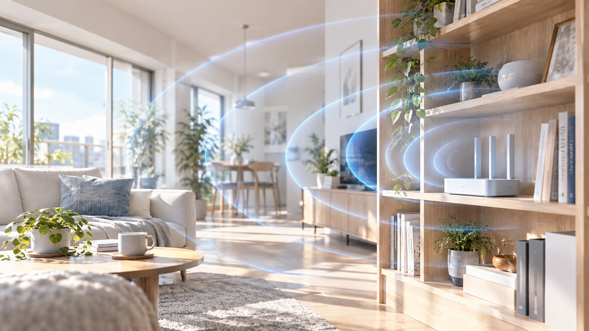
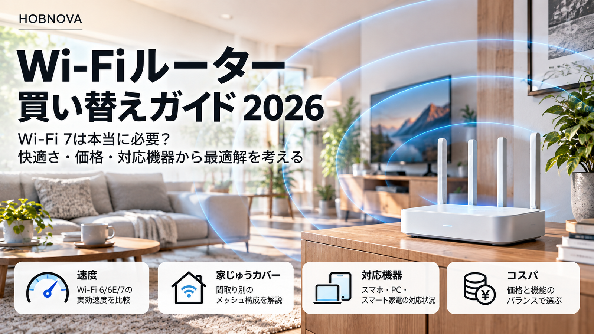

「Wi-Fiが遅い。そろそろ新しいルーターに買い替えようかな」

動画が途中で止まる。オンライン会議の声が途切れる。スマホを持って寝室へ行くと、急に読み込みが遅くなる。

そんなとき、つい気になるのが最新のWi-Fi 7。売り場には大きな速度の数字が並びます。でも、**遅さの原因が置き場所や回線側にあるなら、最新機種に替えても期待どおりには改善しません。**

まず家のどこが詰まっているのか。そのあとで買い替えを考える。この記事は、その順番を整理するためのガイドです。

## 最初に結論。買う前に「近く・遠く・有線」の3か所を測る

Microsoftは、自宅のWi-Fiを調整する前後に、家の複数地点で速度を測って記録することを勧めています。

測定は、同じ端末・同じ速度測定サービス・できるだけ近い時間帯で。まず次の3条件を比べます。

| 測る場所 | 分かること | 次に試したいこと |
|---|---|---|
| ルーターの近く（Wi-Fi） | 無線の基本的な調子 | 帯域や端末を確認 |
| 普段遅い部屋（Wi-Fi） | 距離・壁の影響 | 置き場所やメッシュを検討 |
| ルーターに有線接続したPC | 回線側の目安 | 回線・LANポート・機器を確認 |

有線接続できるPCがなければ、最初は近くと遠くの2地点だけでも十分。測定値は通信先や混雑で揺れるので、各地点で複数回測り、極端な1回だけで判断しないのがコツです。

**近くでは速く、離れると遅い**なら、まず電波の届き方。**近くも有線も遅い**なら、回線・混雑・機器の設定も疑います。これは原因を確定する診断ではなく、切り分けの第一歩です。

## 置き場所だけで変わることがある

Wi-Fiルーターは、コンセントと光回線の位置に引っ張られがち。床の隅、テレビ台の奥、金属ラックの中。普段は目に入らない場所ほど、電波には不利なことがあります。

Microsoftの公式ガイドでは、障害物を減らし、できれば**家の中央寄り・高めの位置**に置くことを推奨しています。角や机の下は避けたい配置です。

いきなり家具を大移動する必要はありません。まずは数十センチ〜1メートル程度、周囲が開けた場所へ移して同じ地点で再測定。改善したら、買い替え前に答えが見つかったことになります。

ただし、ルーターの通気口を塞がないこと。熱がこもる箱の中へ隠すのも避けたいところです。

## 2.4GHz・5GHz・6GHz。速さだけで選ばない

| 帯域 | 得意なこと | 苦手なこと | 使い分けの目安 |
|---|---|---|---|
| **2.4GHz** | 距離や壁への比較的強い伝わり方 | 混雑しやすく速度は控えめ | 離れた部屋、IoT機器 |
| **5GHz** | 速度と使いやすさのバランス | 壁や距離で弱くなる | PC、動画、普段使い |
| **6GHz** | 近距離で高速・混雑が少ない傾向 | 壁・距離に弱く対応端末が必要 | 近くの対応PC・スマホ |

これはMicrosoftが整理する一般的な傾向。**6GHzだから家じゅう速い、という話ではありません。** 6GHzはルーターだけでなく端末側もWi-Fi 6E/7対応であることが必要です。

ちなみにAppleは、対応するすべての帯域で同じネットワーク名（SSID）を使い、チャネルは自動、2.4GHzのチャネル幅は20MHzを推奨しています。帯域を調べるため一時的にSSIDを分ける方法はありますが、普段の設定は端末・ルーターの組み合わせに合わせて考えましょう。

## 「20Mbps→300Mbps」で、待ち時間はどれだけ変わる？

速度の数字だけでは、暮らしの差が想像しにくいもの。そこで、**10GBのデータをダウンロードする場合**を計算してみます。

計算式は `10GB＝80,000Mb、所要秒数＝80,000Mb ÷ 通信速度（Mbps）`。1GB＝10億バイト、通信速度が一定で、通信上のロスがないと仮定した理論上の所要時間です。

| 実効速度の仮定 | 10GBの理論上の所要時間 |
|---|---:|
| 20Mbps | 約66分40秒 |
| 100Mbps | 約13分20秒 |
| 300Mbps | 約4分27秒 |
| 1,000Mbps | 約1分20秒 |

20Mbpsから300Mbpsなら、同じデータの待ち時間は**約15分の1**。ただし実際には、通信プロトコルのオーバーヘッド、サーバー側の速度制限、回線の混雑などで長くなります。動画視聴の快適さも、単純なダウンロード速度だけでは決まりません。

ここで大切なのは、**Wi-Fiの規格上の最大速度と、インターネットの実効速度は別物**という点。回線契約が1Gbpsでも、常に1Gbps出るわけではありません。

## 買い替えるなら「6・6E・7」のどれ？

選び方は、最新かどうかよりも、何に困っているかで変わります。

| 家の状況 | まず考える選択肢 | 理由 |
|---|---|---|
| 1Gbps程度の回線で動画・Webが中心 | Wi-Fi 6も候補 | 端末と置き場所の方が効く場合がある |
| 対応端末があり、近距離の6GHzを使いたい | Wi-Fi 6Eまたは6GHz対応Wi-Fi 7 | 6GHzを使うだけなら7は必須ではない |
| 2Gbps以上の回線、対応端末、家庭内大容量転送 | Wi-Fi 7を検討 | 高速ポート・MLOなどを生かしやすい |
| 離れた部屋だけ弱い | メッシュWi-Fi・有線AP・配置変更 | ルーター単体の規格更新より届く範囲が重要 |

なお、**Wi-Fi 7製品でも6GHz非対応のモデルがあります。** 例えばTP-LinkのArcher BE260は2.4GHz・5GHzのデュアルバンドWi-Fi 7です。「Wi-Fi 7」と書いてあるだけで判断せず、対応帯域、WAN/LANポート速度、メッシュ対応を個別に確認してください。

Wi-Fi 6Eと7の技術差を詳しく知りたい方は、[Wi-Fi 7と6Eの比較記事](/gadget/wifi7-vs-wifi6e/)も参考になります。

## 価格差は「3年間の月額」に直すと冷静になれる

例えば本体価格が1万2,000円、2万4,000円、3万6,000円の3台で迷ったとします。これは**市場価格の調査結果ではなく、比較のための仮の金額**です。3年間（36か月）使うと仮定すると、次のようになります。

| 仮の購入価格 | 3年間の月あたり本体代 |
|---|---:|
| 12,000円 | 約333円 |
| 24,000円 | 約667円 |
| 36,000円 | 1,000円 |

1万2,000円と3万6,000円の差は、3年間なら月あたり約667円。毎日オンライン会議をする家なら払う価値があるかもしれません。一方、スマホでニュースを見る程度なら、使わない機能にお金を払うことにもなります。

ここには電気代・回線料金・追加機器代は含めていません。大事なのは、**高い機種が得かではなく、自分の困りごとが解消するか**です。

## 買い替え前のチェックは、この順番

1. 同じ端末でルーター近くと遅い部屋の速度を記録する
2. 可能なら有線接続でも測り、回線側と無線側を切り分ける
3. ルーターを中央寄り・高め・障害物の少ない場所に移す
4. 端末が接続している帯域と対応規格を確認する
5. チャネル自動設定、2.4GHzの幅、ファームウェア更新を確認する
6. 離れた部屋だけ弱ければ、メッシュや有線アクセスポイントを検討する
7. それでも足りないとき、対応端末・回線・WAN/LANポートに合う機種を選ぶ

セキュリティ設定もついでに見直したいところ。AppleはWPA3パーソナル、または古い機器との互換性が必要な場合のWPA2/WPA3移行モードを推奨しています。設定を変更すると機器が再接続を求めることがあるので、作業前に管理画面の接続方法とパスワードを確認しておきましょう。

## 結論。Wi-Fiの快適さは「買った後」より「買う前」で決まる

Wi-Fi 7は魅力的です。対応端末と高速回線がそろえば、確かに選ぶ理由がある。

でも、家の隅で電波が弱い問題に、最新規格だけで挑むのは遠回りかもしれません。

まず測る。置き場所を変える。帯域を確認する。それでも足りなければ、買い替える。

箱に印刷された最大速度より、**寝室でも会議が切れないこと。動画を再生するとき、読み込みを待たないこと。** そんな普通の快適さを基準にしたいところです。

## 参照した公式情報（2026年10月8日確認）

- [Microsoft：Wi-Fiと自宅のレイアウト](https://support.microsoft.com/ja-jp/windows/experience/connectivity-networking/wi-fi-and-your-home-layout)
- [Apple：Wi-Fiルーターとアクセスポイントの推奨設定](https://support.apple.com/ja-jp/102766)
- [Intel：Wi-Fi 6とWi-Fi 6E/7の6GHz帯対応](https://www.intel.co.jp/content/www/jp/ja/support/articles/000099711/wireless.html)
- [TP-Link：Archer BE260製品仕様（2.4GHz・5GHz対応Wi-Fi 7）](https://www.vigi.com/jp/home-networking/wifi-router/archer-be260/)

※記事内の転送時間・本体代はHOBNOVAによる条件付き試算であり、製品の実測結果や価格調査ではありません。